## 簡介

AdaIN  由 Huang et al. 於 2017 的 *Arbitrary Style Transfer in Real-time with Adaptive Instance Normalization* 提出，藉由Ulyanov的instance normalization擴展類神經網路的風格遷移能力能夠學習任意的風格圖片，並藉由Jhonson的Fast style transfer架構達到最快的推論速度。

## 模型結構

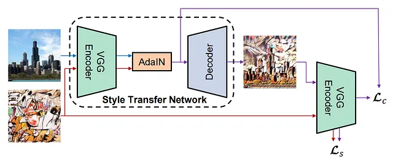

主要的改進是將AdaIN作為encoder和decoder的中間件，使得模型可以一次學習多個風格。

## 資料集

內容圖片: MS COCO的13萬張圖片，小於這個量有可以達到效果。

風格圖片: Pinterest上隨機收集的圖片40張。

## 訓練

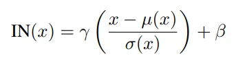

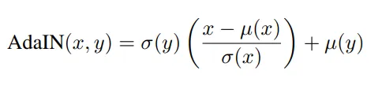

Instance normalization相較batch normalization保留了個別圖片的1st moment和2nd moment，更適合使用在風格遷移上。而AdaIN的假設是不同風格圖片的平均值及標準差即能表達其風格特徵，文中提到一個過渡階段的方法是conditional IN(CIN)，CIN是對每個風格都準備一個IN層，所以作者在這邊提出更general的假設，實驗的結果也佐證了這個想法。

從個人角度來看，深度學習的normalization數學β是1，ε是0的線性迴歸。

## 展示

- 轉換

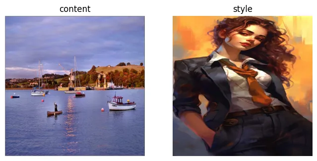

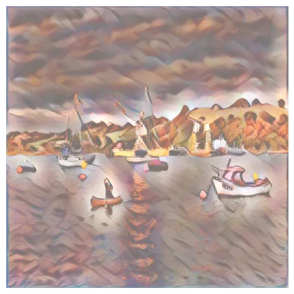

- 轉換權重(風格遷移的程度)

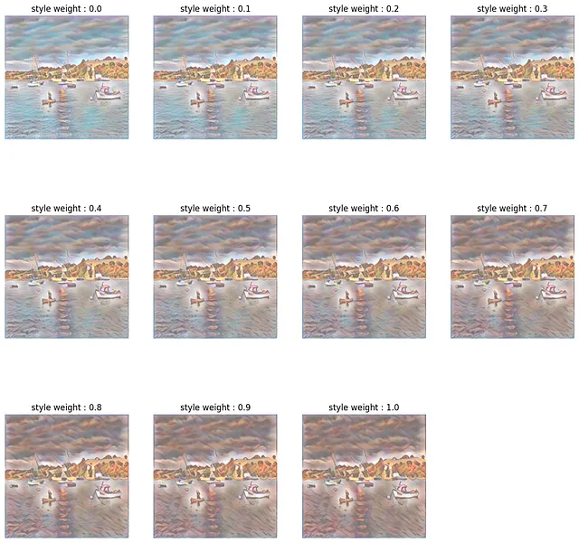

- 轉換插植(多個風格同時轉移)

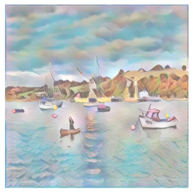

- 顏色保留

Gatys et al 在 *Preserving Color in Neural Artistic Style Transfer* 提出兩種方法保留內容圖片的顏色。

1. Color histogram matching: 該方法使用線性方法將風格圖片的像素轉換到內容圖片的像素，並使兩張圖片的平均值及共變異矩陣相匹配，我覺得公式像是線性迴歸的矩陣解。作者測試過三種解法，Cholesky decomposition、eigenvalue decomposition、Monge-Kantorovitch linear transform，其中eigenvalue decomposition表現最好與第三種方法相當。

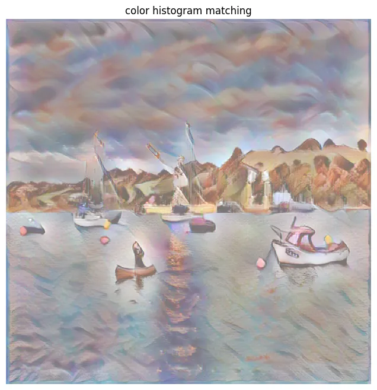

2. Luminance-only transfer: 因為人類的感知對亮度比顏色敏感，所以只須保留生成圖片的亮度即可。作法是將生成圖片轉為YIQ空間，再把生成圖片的IQ換成內容圖片的IQ即可。如果風格圖片的亮度跟內容圖片的亮度差異太大，可先將作將風格圖片亮度標準化後，再用內容圖片亮度的平均值跟標準差還原，達到對齊的效果。

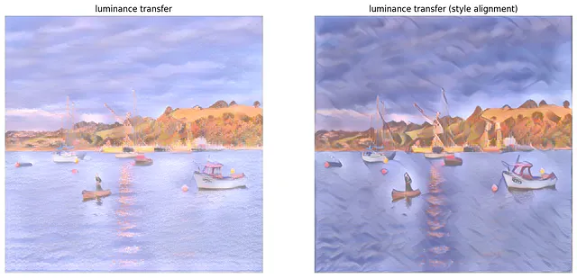

- 空間保留

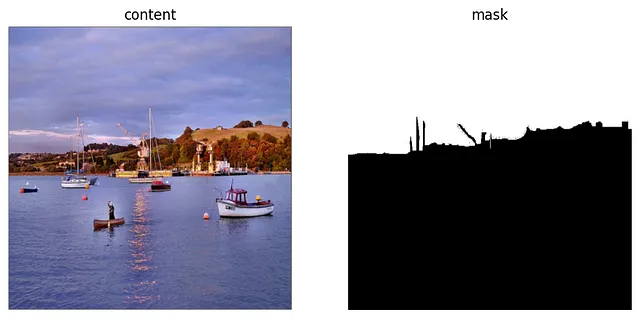

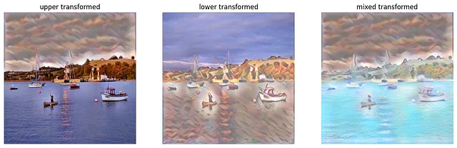

## 筆記

1. 內容圖片資料量: 使用VOC的3萬張圖片會得到斑點式畫風，而COCO的十三萬張圖片會得到線條還原度高的結果。

2. 風格圖片資料量: 數量太小會導致AdaIN層沒有幫助，成效會太差。

3. 論文裡極其強調改用IN後不可再搭配其他歸一層(normalization layer)。

4. Style loss 改用 1st moment 跟 2nd moment 為優化對象，我感覺到大數法則的味道，作者認為是對Gram matrix的放寬。Style的正則參數不高，類似Neural doodle。

5. 相較其他風格遷移方法，AdaIN的生成結果比以往的方法，更注重線條以及物件的切割，細節上也比較忠於內容圖片，但風格的效果不強，單純是塗上風格圖片的顏色。

## 代碼連結

* [github repo](https://github.com/gitE0Z9/pytorch-implementations)

## 參考

* [paper](https://arxiv.org/abs/1703.06868)

* [space preservation](https://arxiv.org/abs/1611.07865)

* [color preservation](https://arxiv.org/abs/1606.05897)
