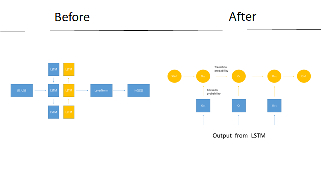
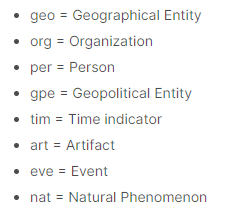
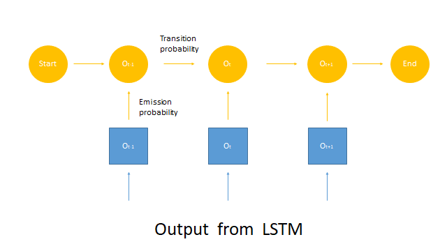
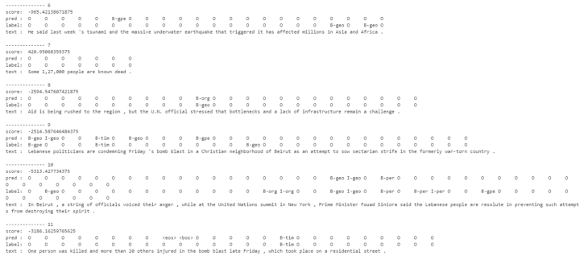
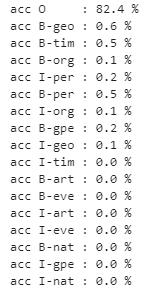

## 簡介

BiLSTM-CRF 是由Huang et al.(2015)在論文 *Bidirectional LSTM-CRF Models for Sequence Tagging* 提出，用於命名實體識別(NER)任務中。相較BiLSTM，增加CRF層使得網路得以學習tag與tag間的條件機率。

## 任務

命名實體識別(Named Entity Recognition, NER)，主要的應用在於找出文本中的重要字詞、擷取資訊，與之前介紹的 POS Tagging (詞性標註)相同，但在應用上有所不同。

## 資料集

[Annotated Corpus for Named Entity Recognition](https://www.kaggle.com/abhinavwalia95/entity-annotated-corpus)，Kaggle上的NER標記資料集。

## 網路

##  訓練

這個方法特別之處在於加入了條件隨機場對LSTM的輸出做序列建模，損失函數也是依這個條件設計的，透過最小化估計token路徑的 log likelihood 與真實token路徑的 log likelihood差(Likelihood Ratio)做為最佳化的條件。

\# 本次訓練LSTM使用 CPU 會比 GPU 快上2倍以上。

## 預測

用Viterbi最佳路徑作為推論的解碼方法，它是一個前向-後向演算法，前向計算路徑分數，後向取回最佳token。

##  評估

訓練十個回合，共47959條句子，17個目標token。

雖然表現不是很優，但有預測出合理的序列。

去除 Pad token的準確度是: 0.8473，不過這結果不是很有用，讓我們進一步確定每個 BIO 的準確度吧。

準確度事實上是極低的，主要都是由O所提供，其他帶有資訊的標記並沒有了解到如何判別。除了可以檢查資料集的標記，也可能是參數要做調整。

## 代碼連結

* [github repo](https://github.com/gitE0Z9/classical-network-series)

## 參考

* [pytorch tutorial](https://pytorch.org/tutorials/beginner/nlp/advanced_tutorial.html)

* [another github repo](https://github.com/SkyAndCloud/bilstm_crf_sequence_labeling_pytorch)

* [paper](https://arxiv.org/abs/1508.01991)