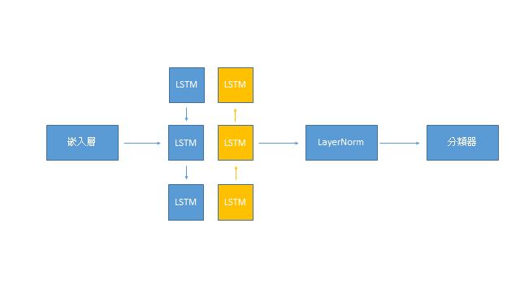

## 簡介

雙向 LSTM(bidirectional LSTM)是由Schuster et al.(1997)在 *Bidirectional Recurrent Neural Networks* 提出，其概念類似於人類並不只從前向後地了解序列資料，也能從後向前兩個方向取得表徵，因此藉由堆疊兩層方向一個往前，一個往後的LSTM模型達到相同的訊息傳遞。

## 任務

詞性註記(POS tagging)屬於語言學的任務，標記文字所屬詞性，常見的延伸任務是NER(Named Entity Recognition), word disambiguation, knowledge graph, autocorrection。

## 資料集

採用 torchtext 的 CoNLL 2000 chunking，一個測試POS的資料集。

## 網路

##  訓練

如同多分類任務，使用 Cross Entropy loss 計算每個 token 對應的 class。

##  評估

訓練準確度可達0.80。

## 代碼連結

* [github repo](https://github.com/gitE0Z9/classical-network-series)

## 參考

* [paper](https://deeplearning.cs.cmu.edu/F20/document/readings/Bidirectional%20Recurrent%20Neural%20Networks.pdf)
