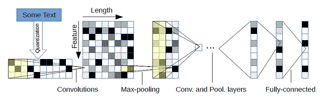
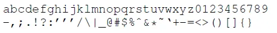
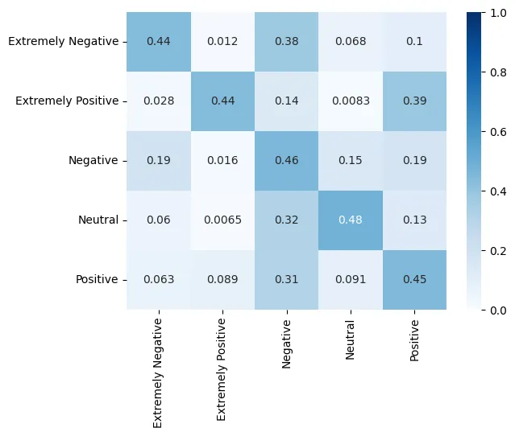

## 簡介

CharCNN由 Zhang et al.(2015)在 *Character-level Convolutional Networks for Text Classification* 提出，特色在於透過卷積神經網路取得文字特徵，角色等同於TF-IDF跟embedding layer。

## 模型概念

以字元為基礎，希望建立起字根、字首等文字的局部特徵層級，進一步到達單詞、片語、句子的資訊，並利用CNN的滑窗採樣僅關注局部空間的性質，達到上述的效果。而CNN取得文字特徵的角色，等同於TF-IDF跟embedding layer，也就是說，CharCNN沒有embedding layer。

## 模型架構

文本需先拆分至字元層級，接著經過one-hot encoding，這個過程作者稱為character quantization。作者設定的編碼張量特徵維度對應到70個字元，序列長為1014，從卷積層和池化層下採樣的反推1014=34*27+96，長度的變動可倚靠該計算用在擴展此網路架構。

最後以MLP迴歸出攤平特徵與分類標籤的權重。

## 資料集

[Covid19-tweet](https://www.kaggle.com/datasets/datatattle/covid-19-nlp-text-classification) , Kaggle上一個關於covid19推特訊息的資料集，分類標籤為情緒，共分五種: Extremely Negative, Nagative, Neutral, Positive, Extremely Positive。

## 評估

測試集的預測結果經由混淆矩陣評估，各類別準確度相近，其中情緒極為正向和極為負向、正向和負向兩程度較難區分。

## 代碼連結

* [github repo](https://github.com/gitE0Z9/classical-network-series)

## 參考

* [paper](https://arxiv.org/abs/1509.01626)
