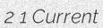
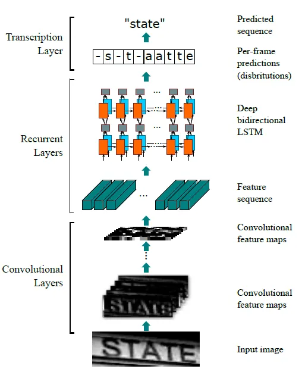

## 簡介

Convolution recurrent neural network 於 2015 由 Shi et al. 的 *An End-to-End Trainable Neural Network for Image-based Sequence Recognition and Its Application to Scene Text Recognition* 提出，主要用於文字辨識或聲音事件辨識

## 資料集

[TextRecognitionDataGenerator](https://github.com/Belval/TextRecognitionDataGenerator)(`pip install trdg`) 好用的文字合成圖產生器。如果沒有自訂的文字內容還可以上wikipedia取得。我們共生成了987張圖片。

  

## 網路

模型設計如同其名，經由VGG啟發的CNN捕捉視覺特徵後，用RNN推論出序列，RNN的序列長度由CNN的寬度決定，CNN的部分原文取用矮寬而非常見的方形 kernel。   

## 訓練

OCR的模型設計如同物件辨識可能是一階段或二階段(偵測再辨識)，CRNN負責的是二階段中的辨識角色，意即輸入的圖片是邊界確定的，模型認定輸入圖片裡的資訊全部都與目標相關，即使是差了幾個像素的白點也會影響判斷結果。

相較於NER這類序列預測任務，OCR的相似之處在於兩者皆輸入序列並輸出序列，但不同之處在於OCR的輸出長度可以不等同於輸入長度，這點與物件辨識類似，也因此是transformer類目標偵測器的特色。

這裡使用 CTC loss作為損失函數，由於其讓預測序列與目標序列對齊的特點，CTC loss 類似之前 BiLSTM-CRF 的 CRF 層，利用條件機率尋找最佳的預測序列，差別在於CTC多了忽略變數，忽略變數可作為文字個體的判斷，也帶來長度上的限制使輸出不能比輸入長，該特性也會發生在CNN縮減取樣尺吋的部分，另外忽略變數有時不好選擇，例如如果使用空格就無法在輸出中保留空格，使用emoji也會有一樣的問題。

詳細可參考[這篇文章](https://distill.pub/2017/ctc)。

本文採用pytorch內的ctc_loss，強調這點是為與百度的C語言版本區別。

pytorch實作的範例可以參考[這個repo](https://github.com/dredwardhyde/crnn-ctc-loss-pytorch/blob/main/ctc_loss_example.py)

解碼部分可分為viterbi的前向後向演算法或beam search，兩者在序列演算法中算是常見的方法。

## 評估

平均 Levenshtein 距離是1.57。

## 筆記

1. 垂直方向: 有人用轉置處理，訓練垂直方向的模型。相較下Attention OCR倒不大有方向的問題，但對長文本可能計算量大。

2. 圖片大小: 原先 CRNN處理的是橫向、有一定長度的文字，對文件類的處理還好，但對場景辨識不一定適合，或者一些長寬比奇葩的圖片更是如此。

3. 保留空格: 原先的CRNN實作多半只能處理連續沒有空格的文字，本篇的處理方式是把blank換成不需要辨識的符號，例如本篇使用emoji。

4. Batchify: 圖片不定長、預測不定長、標籤不定長都可用padding處理，官方提供的CTC loss 可使用mask。

## 代碼連結

* [github repo](https://github.com/gitE0Z9/classical-network-series)

## 參考

* [original github repo](https://github.com/meijieru/crnn.pytorch)

* [paper](https://arxiv.org/abs/1507.05717)
