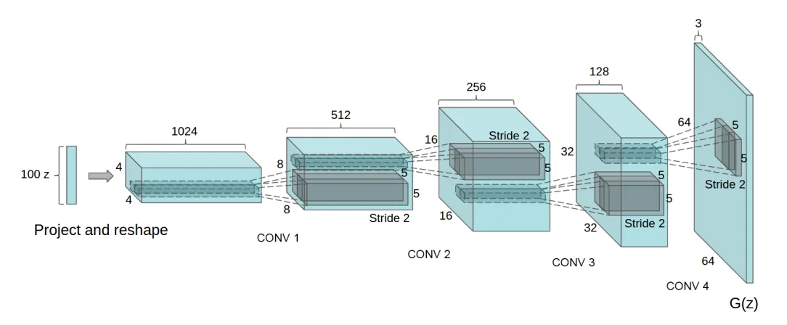
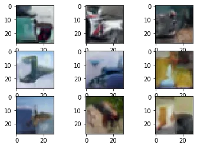

## 簡介

DCGAN是由Radford et al.(2015)在 *Unsupervised Representation Learning with Deep Convolutional Generative Adversarial Networks* 提出，是結合CNN和GAN的經典範例，提升GAN對應的資訊層次，不再只限於過往的線性層，還能包含卷積層的訊息。

## 資料集

CIFAR-10，一個包含十種物件的圖像分類資料集。

## 網路

相對應單純的卷積神經網路，輸入是長度100的常態分佈亂數，最終生成微小的64 x 64 RGB圖片。

## 損失函數

採用 Binary Cross Entropy loss。

## 訓練

同GAN的訓練方式。

## 評估

## 代碼連結

* [github repo](https://github.com/gitE0Z9/classical-network-series)

## 參考

* [original github repo](https://github.com/eriklindernoren/PyTorch-GAN)

* [paper](https://arxiv.org/abs/1511.06434)