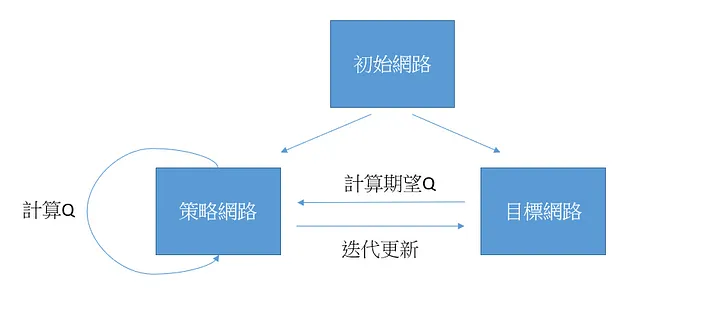

## 簡介

Deep Q Learning 是由Mnih et al.(2014)在 *Playing Atari with Deep Reinforcement Learning* 提出，可以說是第一個將增強學習與深度學習結合的經典範例。

## 環境

DemonAttack-v5，射擊遊戲。

## 網路

策略網路負責計算當下Q值以及保存當前的權重並定期更新目標網路，目標網路則負責計算期望Q值。

由於Q learning是model-agnostic的方法，因此模型可以自行選擇。

## 訓練

Q value: 行動的回饋值。

Q learning: 計算期望Q值，並逐步逼近真實Q值的方法。

off-policy: 增強學習常見的問題是exploration和exploitation如何取捨，DQN採取ϵ-greedy為策略，ϵ是指exploration的機率，如果隨機機率低於ϵ，則隨機選取一個行動，若高於ϵ，則使用最高Q值的行動。

## 評估

2分鐘內，五回合分數大致在60分左右。

沒有採取的作法: 依優先度採樣回憶。

可以改進的部分:

1. agent不認為移動是當下最佳的行動，會停於某處射擊。

2. agent的認知中，被擊中不會有負回饋的影響。

=> 我也學會玩這遊戲了，要等子彈裝好才能發射。

## 代碼連結

* [github repo](https://github.com/gitE0Z9/classical-network-series)

## 參考

* [tutorial](https://pytorch.org/tutorials/intermediate/reinforcement_q_learning.html)

* [paper](https://arxiv.org/abs/1312.5602)
