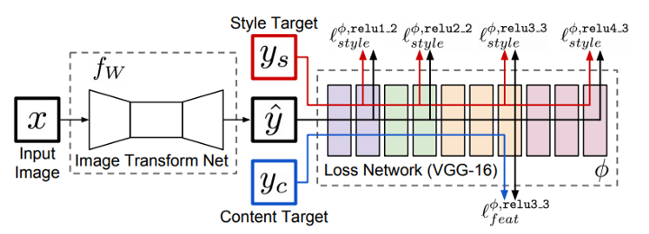
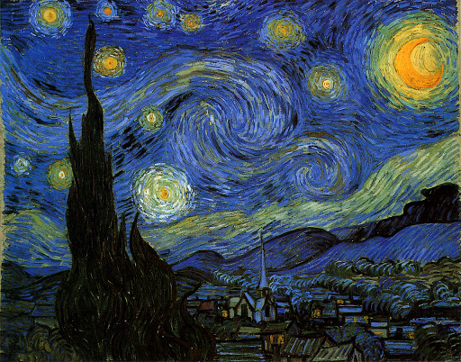
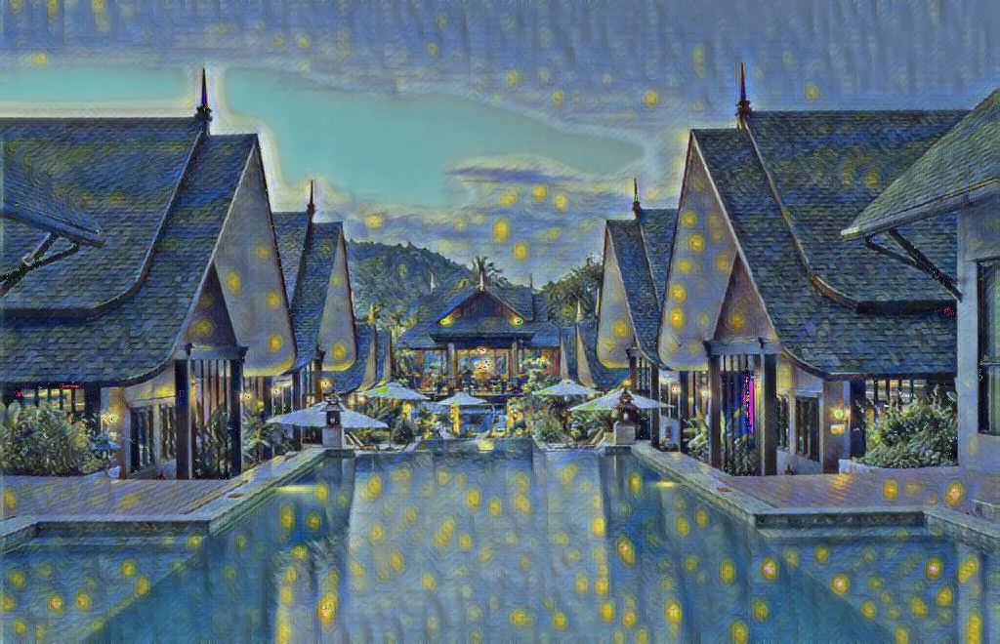
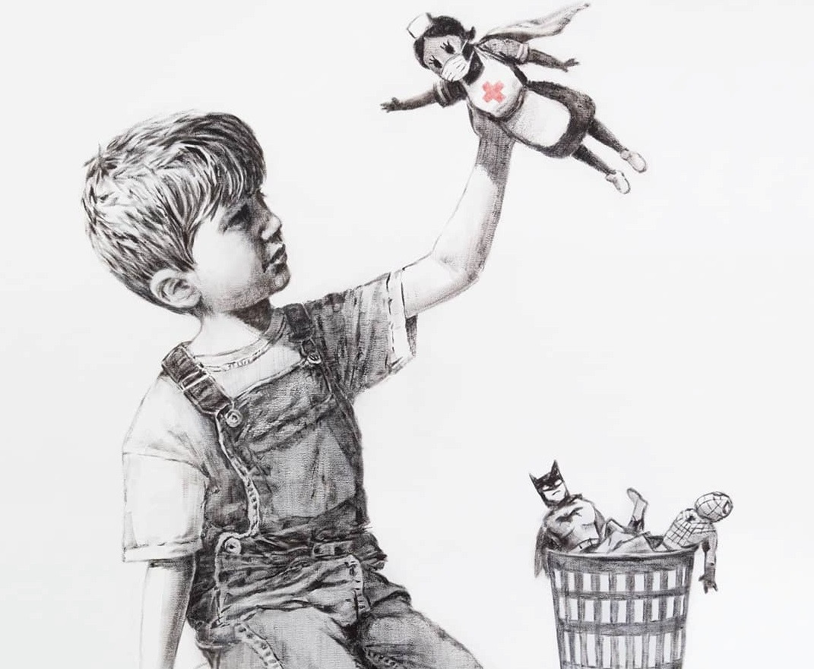
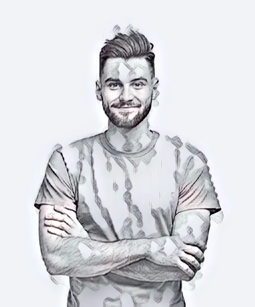

## 簡介

Fast style transfer 由 Justin Johnson et al. (2016)在論文 *Perceptual Losses for Real-Time Style Transfer and Super-Resolution* 提出，主要特點在於將Gatys 的風格遷移模型從迭代更新圖片的方式轉為以類神經網路學習特定的一種風格，從而節省推論時間，不需要再對每個圖片對做訓練，甚至能生成高解析度影像。

## 網路

後半部的特徵抽取方式仍採用VGG一家的模型，相較Gatys的地方在於前面的生成網路。我們如同教學，採用 Instance Normalization。

## 訓練

若要採用這個方法做風格遷移，有個特點是必須要採用很大的圖片資料集(至少上萬張)做內容圖片，但從VOC的圖片數量級提升到COCO效果差異也不大，反應風格轉換的網路學習能力是具有飽和性的，畢竟學習再多視覺特徵，終究是受限於同一個風格。

資料集 : VOC2012(17000張)、MSCOCO2017(123000張)

損失函數 : 同樣是 Gatys 的 Gram Matrix

> 如果要做semantic的轉換(部份遷移)，同 Neural Doodle的作法應該可以，可參考 Instance Normalization的作者 [Ulyanov 的 fast neural doodle](https://github.com/DmitryUlyanov/online-neural-doodle)。

## 評估

- 梵谷的星空是很常用的風格圖片
- 學到顏色和斑點，但是沒有紊流和藝術感
- 這個實作中，大部分圖片轉換都會失敗

  

- 試試看素描吧
- 學到手毛、衣服的陰影，但在邊界會有雜訊

  

- 變快了，當然也可以用在影片上囉

## 筆記

1. 雖然推論變快了(25ms at 224x224)，模型也很小(6.5MB)，但需要大型資料集訓練耗時，實作中發現VOC2012效果與MSCOCO2017差異並不大。

2. 一次只能學習一種風格，相較原本的方法缺乏彈性。

3. 原本的方法比較不需要煉丹。

4. 以 ImageNet 做 standardization 生成的結果無法保留線條且對語義(天空是哪個區塊、主角是誰)不清楚，沒有 standardization 時較佳。

5. 深層的卷積特徵產生灰濛濛、單一色彩的結果，淺層比較好。

6. 常有灰色區塊。

7. 沒有原本的 neural style transfer 藝術，學的很淺，只學到顏色或斑點，但對藝術風格表現欠佳。

## 代碼連結

* [github repo](https://github.com/gitE0Z9/classical-network-series)

## 參考

* [original github repo](https://github.com/pytorch/examples/tree/main/fast_neural_style)

* [paper](https://arxiv.org/abs/1603.08155)
