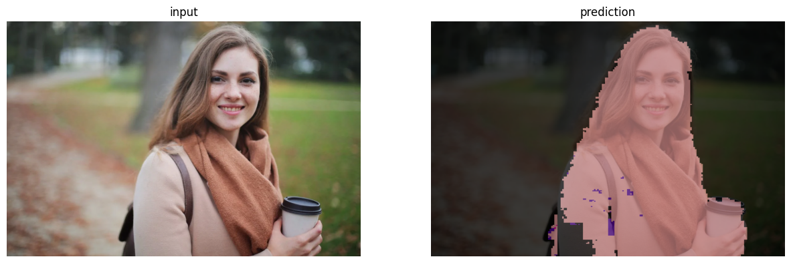

## 簡介

全卷積網路(Fully Convolutional Network)是由Long et al.(2014)在 *Fully Convolutional Networks for Semantic Segmentation* 提出，主要用於像素級任務，如語意分割。設計概念是用上採樣的方式恢復下採樣的特徵圖達到不同層級特徵圖的融合，同時提升類神經網路的特徵抽取能力。

## 任務

語意分割，針對像素級別做分類。

## 資料集

PASCAL VOC 2012，一個著名的影像資料集，包含物件偵測和語意分割等任務。

## 網路

採用加法整合上採樣的輸出和下採樣的輸出。

## 訓練

如同多分類任務，對每個像素都做多個類別的分類。

## 評估

## 代碼連結

* [github repo](https://github.com/gitE0Z9/classical-network-series)

## 參考

* [original github repo](https://github.com/pochih/FCN-pytorch)

* [paper](https://arxiv.org/abs/1411.4038)
