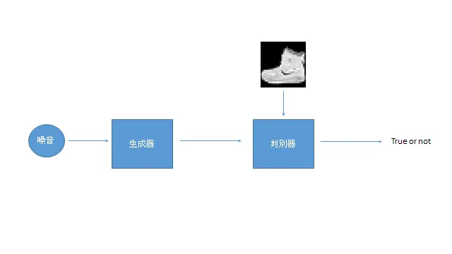
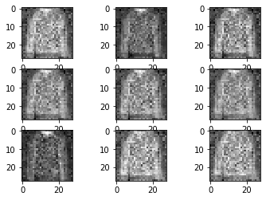

## 簡介

生成對抗網路由 Goodfellow et al.(2014) 於 *Generative Adversarial Networks* 提出，是一種廣為人知的生成模型架構，曾被使用在AlphaGo的設計理念中。

## 資料集

Fashion MNIST，衣物裝飾的灰階資料集。

## 網路

設計概念是讓生成器與判別器對抗，依靠判別器判斷輸入值是否為真來引導生成器的能力。

## 損失函數

採用Binary Cross Entropy loss作為判別器的損失函數。

## 訓練

依序訓練生成器和判別器，首先欺騙判別器生成的都為真，接著告訴判別器何為真的圖片，何為生成的圖片。

## 評估

訓練二十個回合後，有衣服的形狀。

## 筆記

1.  判別器的設計、優化器的參數對生成圖像的成功與否有著很大的影響力。

## 代碼連結

* [github repo](https://github.com/gitE0Z9/classical-network-series)

## 參考

* [original github repo](https://github.com/eriklindernoren/PyTorch-GAN)

* [paper](https://arxiv.org/abs/1406.2661)
