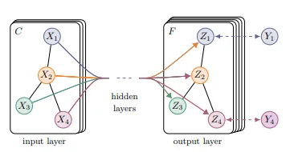
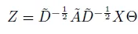

## 簡介

GCN由 Kipf et al.(2016)在 *Semi-Supervised Classification with Graph Convolutional Networks* 提出，藉由簡化Cheybshev polynomial，為GNN打下實用的基礎，並展現優良的半監督效果及圖表達能力。

## 模型概念

圖神經網路(GNN)藉由圖結構傳遞聚合不同節點的資訊，使得深度學習更有效率使用各記錄間的關係。在數學中，圖(graph)指的是節點(vertex)和邊(edge)的集合，節點可以視為個體，邊可以視為個體間的關係。相較更早的GNN，Graph convolution network(GCN)的改進在於使用ChebNet的一階項來簡化計算 ，推導出的訊息傳遞矩陣是個歸一化拉普拉斯量矩陣。

與卷積網路的關係可以從圖結構會以鄰近矩陣(Adjancency matrix)表達，D矩陣表示degree是每個節點與多少節點相鄰，在計算上，訊息傳遞矩陣T可以簡單表達為 T_ij = (A_ij+I_ii)/degree_i。每個節點都會整合鄰近節點的訊息，這點與卷積網路在圖片上的運算相同，只是抽樣的選擇不同。

對半監督的特性來自於圖結構的引入，沒有標籤的新節點可以經由圖結構傳遞訊息，因此即使沒有標籤的節點，資訊也可以在訓練階段被整合到網路權重裡。

## 模型架構

訊息傳遞矩陣與線性層轉換後的特徵相乘，使不同節點的資訊得以整合傳遞。殘差結構也有助於更深層的網路穩定性。

歸一化拉普拉斯量矩陣經由參數化技巧可整理成以上形式，鄰近的節點資訊會加總傳遞到下層。

## 資料集

PubMed，醫學生物領域期刊資料庫，收集論文間彼此的引用關係，資料來源是Graph2Gauss，每個節點有500個特徵，共3個分類標籤。

## 評估

**優點:**

搭配稀疏張量，訓練速度極快。模型也極輕量，只有數百KB。網路深度可淺可深，論文附錄B有寫到如何使用殘差結構加深網路，實作中亦有提供。

**缺點:**

1. 不能使用batch，需一次餵入整張圖，如果是密集的圖結構會很吃計算資源。

2. 預測結果是在節點層級，論文有提到邊層級的預測可以用關係節點表達，圖層級則沒有提到。

3. 主要是針對無向圖，有向圖要另外處理。

4. 論文提到GCN可以視為一維Weisfeiler-Lehman演算法的擴展。

## 代碼連結

* [github repo](https://github.com/gitE0Z9/classical-network-series)

## 參考

* [paper](https://arxiv.org/abs/1609.02907)
