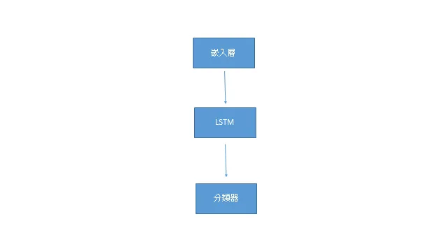

## 簡介

長短期記憶是由Hochreiter et al.(1997) 在 *LONG SHORT-TERM MEMORY* 提出，主要用於序列資料的處理，曾經獲得廣泛的使用與研究，所屬的遞歸類神經網路與卷積類神經網路並列深度學習領域的代表，直到注意力機制出現後逐漸淡出。

## 資料集

IMDB，電影評論正負評的資料集。

## 網路

先將 token id 轉成嵌入向量，進入LSTM擷取序列特徵，過分類器得到迴歸結果。

## 訓練

二分類任務。

## 評估

準確率可達0.85。

## 筆記

1. 模型大小可達破百MB，主要的原因是embedding Layer太大。
   
2. 分類器的輸入是hidden state，而不是output。

## 代碼連結

* [github repo](https://github.com/gitE0Z9/classical-network-series)

## 參考

* [blog](https://towardsdatascience.com/multiclass-text-classification-using-lstm-in-pytorch-eac56baed8df)

* [paper](http://www.bioinf.jku.at/publications/older/2604.pdf)
