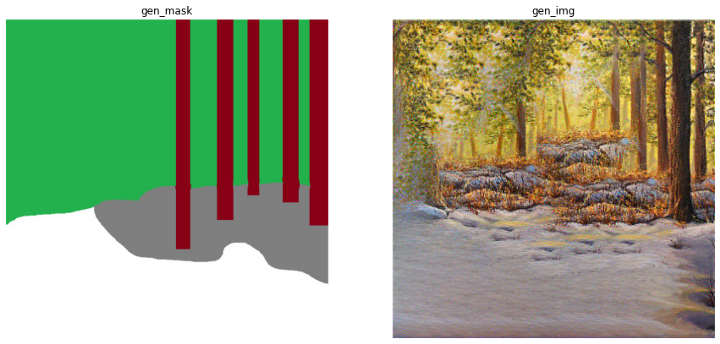

## 簡介

Neural Doodle 由 Alex J. Champandard (2016)在論文 *Semantic Style Transfer and Turning Two-Bit Doodles into Fine Artworks* 提出，主要用途是透過patch-based style transfer將風格遷移到使用者繪製的模板，也可以單獨做到風格遷移。

## 網路

相較於原本的架構，相當於多了一個附屬網路處理模板(mask)和風格及內容的特徵。

##  訓練

風格遷移有很多不同的實現方式，其中Gram-based 和 patch-based兩個方法為主，這兩種都不需要額外的資料作訓練。

相較 Gram-based 方法使用 Gram matrix 計算風格損失，neural-doodle 採用最近鄰 patch 計算風格損失，這類方法被稱為MRF prior(馬可夫隨機場先驗)。

patch-based 方法需要使用多尺度訓練來產生較佳的結果，這麼做相當於讓模型從小畫布開始繪圖，當模型覺得已經畫得很好時，再給它一張更大的畫布

1. 比起一開始就用高解析度繪圖提供更好的起始點

2. 擴大的畫布可以進一步加強較小畫布的結果

實作方式如同論文擴大畫布的方法是上採樣2倍，可以試試resize說不定不會如本文得到預料之外的結果。

##  內容與風格

##  評估

沒有 muliscale: 勉強有些樣子，但圖片都是噪音。樹木剛好有五根。

加入 muliscale: 你不要看不起原稿就超展開呀~~

## 成果

## 代碼連結

* [github repo](https://github.com/gitE0Z9/classical-network-series)

## 參考

* [original github repo](https://github.com/paulwarkentin/pytorch-neural-doodle)

* [neural doodle paper](https://arxiv.org/abs/1603.01768)

* [MRF paper](https://arxiv.org/abs/1601.04589)