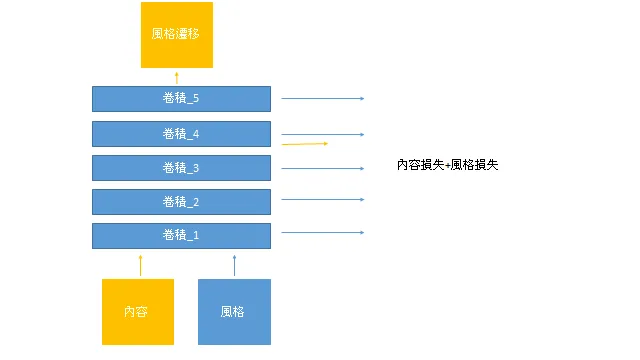
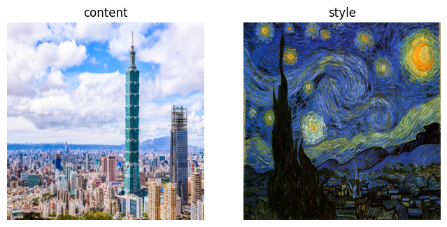
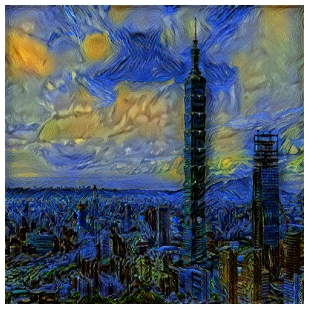

## 簡介

Neural style transfer 由 Gatyss et al. (2016)在論文 *A Neural Algorithm of Artistic Style* 提出，是最早使圖片能變換成另一張圖片風格的深度學習技術之一。

## 網路

## 損失函數

採用 MSE loss 做內容損失和風格損失。每次迭代更新內容圖片，使得輸出圖片可以更接近風格圖片。

## 訓練

採用LBFGS最佳化，以第四層卷積特徵圖計算輸入圖片與內容圖片的內容損失，取前五層卷積特徵圖計算輸入圖片與風格圖片的風格損失，風格損失經Gram矩陣處理後比較。

## 評估

## 筆記

Gram矩陣可以類比為通道(通常是顏色)與像素矩陣的變異數矩陣，包括最後取平均值的部分也很類似，可能是有利於學習風格通道間的變異程度吧。

如此看來風格方面在Gram矩陣一次只會比較9個數值的情況下，所以多取幾層也許合理，而內容方面則只取一層並且比較整張圖的數值，可能是為了一邊確保輸入的圖片可以保持內容圖片的特質，同時將局部的風格特質加入到輸出的圖片上。

有趣的是這個教學只使用了前五層的卷積特徵，沒有使用更深的網路，可能是基於淺層的卷積主要在取得低階的語意特徵(線條、紋理)，在更高階的網路取得的是更加抽象的語意特徵，所以也行得通。

雖然取的層跟原論文不同，結果卻不差。

## 代碼連結

* [github repo](https://github.com/gitE0Z9/classical-network-series)

## 參考

* [original github repo](https://pytorch.org/tutorials/advanced/neural_style_tutorial.html)

* [paper](https://arxiv.org/abs/1508.06576)