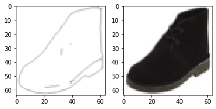
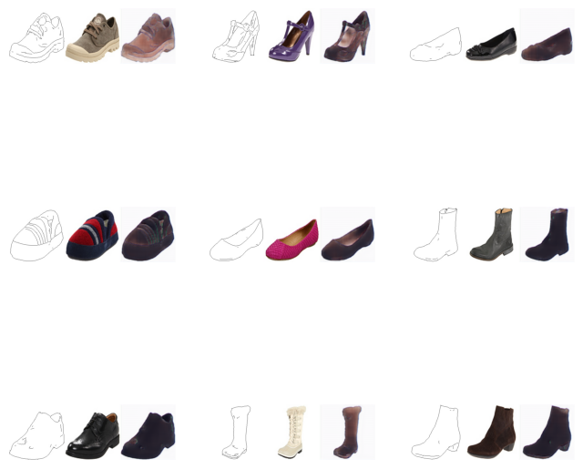

## 簡介

pix2pix是由Isola et al.(2016)在 *Image-to-Image Translation with Conditional Adversarial Networks* 提出，是圖像轉圖像的經典作品。

## 資料集

edges2shoes，一個提供鞋子外框素描與鞋子照片隊的資料集。

## 網路

生成器是UNet，判別器是一個簡單的全卷積網路PatchGAN，PatchGAN的輸入是由channel組起來的圖片對，輸出是每個像素是真是假。

## 損失函數

生成器採用 Binary cross entropy 做GAN的損失函數搭配 L1 loss 做像素級的損失，判別器採用 Binary cross entropy 做GAN的損失函數。

## 訓練

依照GAN的訓練方式，生成器會試圖欺騙判別器，生成越來越真的圖片，判別器會試圖判斷圖片是真是假。

## 評估

優點: 形狀跟紋路大致上正確。

缺點: 像素層級上會有破損、顏色過於灰暗、細節粗略。

## 代碼連結

* [github repo](https://github.com/gitE0Z9/classical-network-series)

## 參考

* [original github repo](https://github.com/eriklindernoren/PyTorch-GAN)

* [paper](https://arxiv.org/abs/1611.07004)