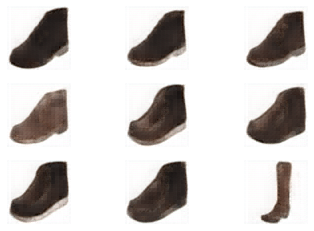

## 簡介

pix2pix是由Isola et al.(2016)在 *Image-to-Image Translation with Conditional Adversarial Networks* 提出，是圖像轉圖像的經典作品。

## 資料集

edges2shoes，一個提供鞋子外框素描與鞋子照片隊的資料集。

## 網路

生成器是UNet，判別器是一個簡單的CNN，CNN的輸入是由channel組起來的圖片對，輸出是每個像素是真是假。

## 損失函數

生成器採用Mean square error loss做GAN的損失函數搭配 L1 loss做像素級的損失，判別器採用 Mean square error loss做GAN的損失函數。

## 訓練

同GAN的訓練方式。

## 評估

## 代碼連結

* [github repo](https://github.com/gitE0Z9/classical-network-series)

## 參考

* [original github repo](https://github.com/eriklindernoren/PyTorch-GAN)

* [paper](https://arxiv.org/abs/1611.07004)