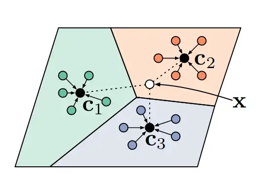

## 簡介

原型網路是由Snell et al.(2017)在 *Prototypical Networks for Few-shot Learning* 提出，用於解決few shot learning，同領域還有Siamese network, Matching Network等模型。

## 資料集

Omniglot, 是一個包含多種語言的字母資料集。

## 網路

以類別的範例作為分類參考，稱之為原型(prototype)，概念類似KNN，在映射空間中越接近某個類別的範例，屬於該類別的可能性越大。

網路結構上，嵌入網路的設計沒有限制，只須確保映射的向量可與原型進行距離上的計算。

## 損失函數

採用 Cross Entropy loss。

## 訓練

進行多分類任務。

## 評估

以one shot learning檢驗，準確度可達28%，還可再精進。

## 代碼連結

* [github repo](https://github.com/gitE0Z9/classical-network-series)

## 參考

* [original github repo](https://github.com/yinboc/prototypical-network-pytorch)

* [paper](https://arxiv.org/abs/1703.05175)
