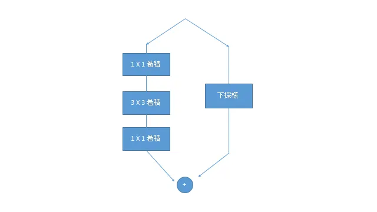

## 簡介

ResNet 是由He et al.(2015)在 *Deep Residual Learning for Image Recognition* 提出，如今已成為最廣為使用的卷積網路骨架，可見其不小的影響力。而使其擁有如此突破的原因莫過於殘差結構，相較於一般的卷積網路，殘差連接使梯度能夠在較深的網路傳遞順暢，減少因梯度消失或突增導致的數值不穩定性。

## 資料集

[Animals-10](https://www.kaggle.com/alessiocorrado99/animals10)，一個包含十種動物，兩萬八千多張照片的資料集。

## 網路

左側是原本的卷積區塊，圖中所示是bottleneck結構，右側即為殘差連接，是梯度能繼續傳遞的關鍵，即使梯度可能因為網路深度增加而傳遞不良，仍可保持一定大小往回傳遞。而下採樣處理是為了對應特徵圖尺寸的變化，若尺寸不變則為identity。許多的ResNet後代，如ResNeXt, SEResNet, SEResNeXt, ResNest多是對左側的卷積結構進行變換，也就是在不改變傳遞的保護方法下，提升特徵抽取的能力。

## 訓練

多分類任務。

## 評估

訓練時間長達每個回合20分鐘。

加入Batch Normalization和ReLU後速度加快且模型大小減少一半以上。

## 代碼連結

* [github repo](https://github.com/gitE0Z9/classical-network-series)

## 參考

* [paper](https://arxiv.org/abs/1512.03385)
