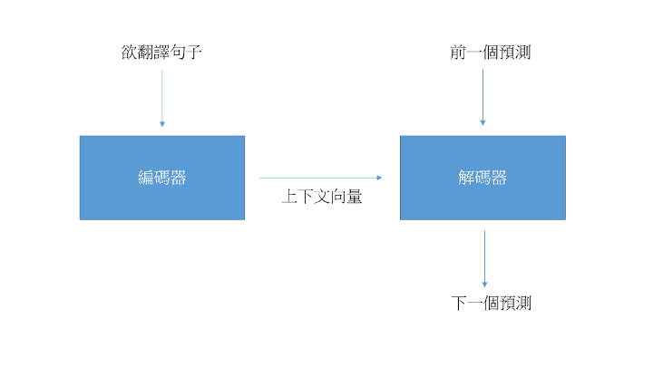
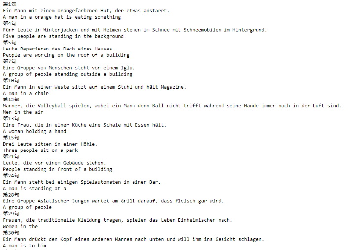

## 簡介

Seq2seq 是由Sutskever et al.(2014)在 *Sequence to Sequence Learning with Neural Networks*   提出，結合編碼與解碼的概念，使LSTM可以處理更廣泛的自然語言任務，是現代NLP的經典架構。

## 資料集

Multi30K，是一個英德語翻譯的資料集。

## 網路

## 損失函數

採用 Cross Entropy loss。

## 訓練

如同多分類任務，分類對應位置預測的 token。

## 評估

10個epoch後的模型，不能產生很長的句子。

## 代碼連結

* [github repo](https://github.com/gitE0Z9/classical-network-series)

## 參考

* [original github repo](https://github.com/bentrevett/pytorch-seq2seq)

* [paper](https://arxiv.org/abs/1409.3215)