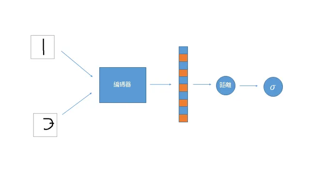

## 簡介

孿生網路是由 Koch et al. (2015) 在 *Siamese Neural Networks for One-shot Image Recognition* 提出，用於解決 one shot 圖片辨認的問題: 如何在只看過一個樣本的情況下學會分類該類別的圖片。

## 資料集

Omniglot, 是一個包含多種語言的字母資料集。

## 網路

概念上是取兩個輸入圖片的相似度，如果同類則標記為1，不同類則標記為0。架構極為簡單，經過編碼器後取兩個輸入特徵向量的距離即可。

## 損失函數

採用 Binary Cross Entropy loss.

## 訓練

如同普通的分類任務。

## 評估

模型可分辨兩張圖片是否為同一類別的準確度達0.90。

## 筆記

1. 實現後發現卷積層並不需要太大，可以用極為輕巧的程度實現。例如這次的模型大小大約為10M，主要影響的因素是最後的全連接層。

2. 模型訓練的資料量也不需要太大，可以在很小的圖片對集下完成訓練，訓練速度也會更快。

## 代碼連結

* [github repo](https://github.com/gitE0Z9/classical-network-series)

## 參考

* [blog](https://towardsdatascience.com/building-a-one-shot-learning-network-with-pytorch-d1c3a5fafa4a)

* [paper](https://www.cs.cmu.edu/~rsalakhu/papers/oneshot1.pdf)
