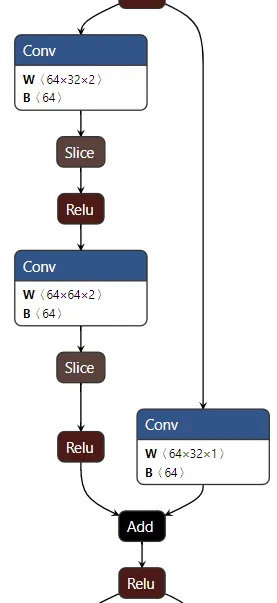
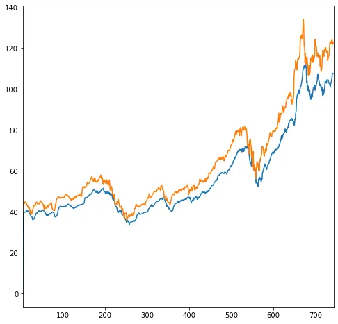

## 簡介

時序卷積網路是由 Lea et al.(2017)在 *Temporal Convolutional Networks: A Unified Approach to Action Segmentation* 提出，成為卷積神經網路在序列資料的代表模型之一。

## 資料集

使用 pandas datareader 取得yahoo的蘋果2018至今的股價。

## 網路

設計概念是經由卷積的滑窗特性達到序列建模的性質，同時藉由遮掩未來訊息達到因果(causal)性質，也就是未來不影響現在。

## 損失函數

採用 Mean Square Error loss。

## 訓練

時間序列的 forecasting 任務。

## 評估

## 筆記

模型大小只有1MB左右。
使用CPU即可，相較LSTM在資源缺乏的情形下是個不錯的選擇。
dilated convolution 要注意dilation size, padding size, slice。

## 代碼連結

* [github repo](https://github.com/gitE0Z9/classical-network-series)

## 參考

* [original github repo](https://github.com/locuslab/TCN)

* [paper](https://arxiv.org/abs/1608.08242)
