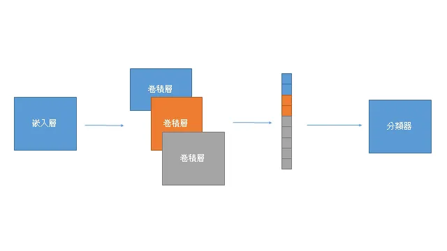

## 簡介

TextCNN由 Kim et al.(2014)在 *Convolutional Neural Networks for Sentence Classification* 提出，是以卷積網路處理文本的開山之作。

## 資料集

[Highly Rated Children Books And Stories](https://www.kaggle.com/thomaskonstantin/highly-rated-children-books-and-stories)，一個有 430 本童書的敘述及其適合年齡的資料集。

## 網路

概念上是將嵌入向量經過不同大小的卷積核提取特徵後，組合成特徵向量，輸出給分類器。

## 訓練

多分類任務。

## 評估

訓練準確度達0.88。驗證準確度達0.10。

## 筆記

1. 訓練速度和推論速度都較LSTM快上非常多。

2. 模型大小約4MB。

## 代碼連結

* [github repo](https://github.com/gitE0Z9/classical-network-series)

## 參考

* [blog ](https://blog.csdn.net/qq_25037903/article/details/85058217)

* [paper](https://arxiv.org/abs/1408.5882)
