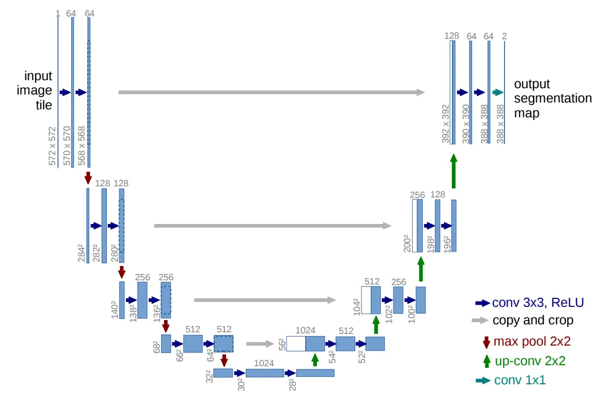
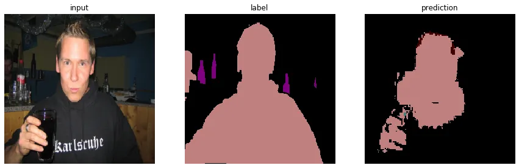

## 簡介

UNet是由Ronneberger et al.(2015)在 *U-Net: Convolutional Networks for Biomedical Image Segmentation* 提出，作為醫學領域上常用的分割網路。根據論文內容，可以使用少樣本學習、處理高解析度影像、特別是針對醫療影像的切割。

## 資料集

PASCAL VOC，一個在電腦視覺界與COCO齊名的資料集。包含許多不同的電腦視覺任務的標記。

## 網路

設計概念是經由卷積的滑窗特性達到序列建模的性質，同時藉由遮掩未來訊息達到因果(causal)性質，也就是未來不影響現在。

## 損失函數

採用 Cross Entropy loss。

## 訓練

如同多分類任務。

## 評估

## 筆記

對於原本的論文，有幾點疑惑

1. 作者使用沒有 padding 的卷積操作，不知道是怎麼將output與label對齊。
2. 作者提到結合下採樣時要進行copy and crop，但沒提crop的內容。
3. 很多技巧的細節沒講Orz。

實作的差異

1. 沒有加入針對醫療影像的技巧，如 overlap-tile strategy, weighted cross entropy(separation border)
2. 沒有使用的訓練技巧，如 data augmentation
3. 以及疑惑的兩點。
4. 使用頻率的倒數作為 cross entropy 的加權

## 代碼連結

* [github repo](https://github.com/gitE0Z9/classical-network-series)

## 參考

* [original github repo](https://github.com/milesial/Pytorch-UNet)

* [segmentation article](https://www.learnopencv.com/pytorch-for-beginners-semantic-segmentation-using-torchvision)

* [paper](https://arxiv.org/abs/1505.04597)
