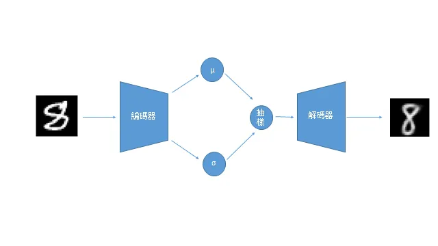
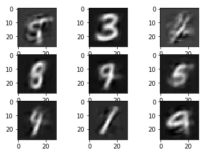

## 簡介

變分自編碼機是由Kingma et al.(2013)在 *Auto-Encoding Variational Bayes* 提出，可視為一種生成模型的架構。

## 資料集

MNIST是一個手寫數字辨識集。

## 網路

概念上是取先取得圖片的潛在特徵，作再參數化，經由常態分佈抽樣，解碼後生成新圖像。

## 損失函數

採用 mean square error 作為重建損失，加上Kullback-liebler 散度。前者使樣本更接近原本的圖片，後者為生成樣本增加噪音。

## 訓練

如同分類任務。

## 評估

生成的圖像不是很清晰，但有各種數字。

## 筆記

1. CPU的訓練速度和GPU差不多。
   
2. 以全連接層實現的模型大小可以少於1MB。
   
3. 使用BCE loss的效果較為黑白分明，MSE loss 則有灰色部分。
   
4. 增加KLD權重，會使圖片更加模糊。
   
## 代碼連結

* [github repo](https://github.com/gitE0Z9/classical-network-series)

## 參考

* [original github repo](https://github.com/AntixK/PyTorch-VAE)

* [blog](https://shenxiaohai.me/2018/10/20/pytorch-tutorial-advanced-02/)

* [paper](https://arxiv.org/abs/1312.6114)
