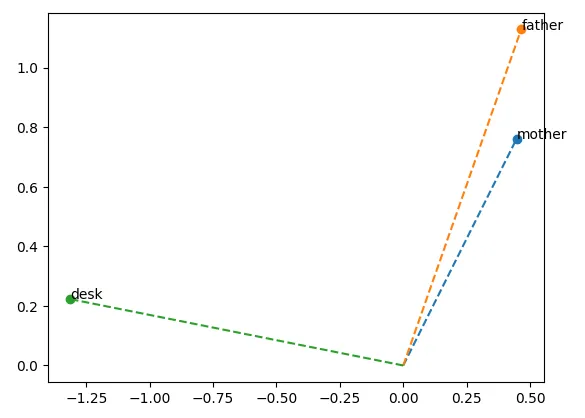
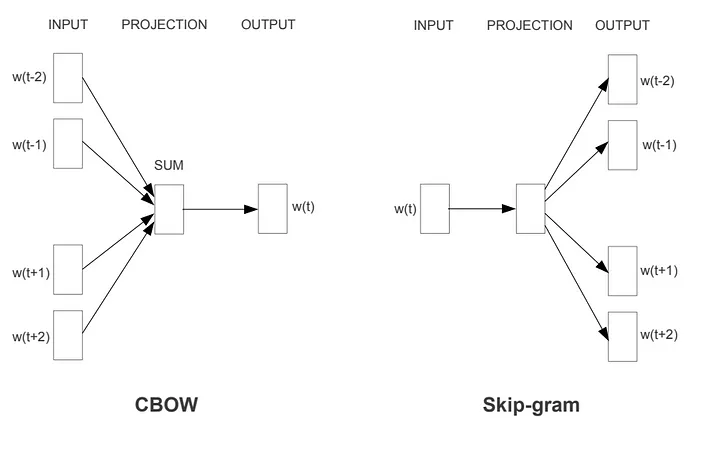
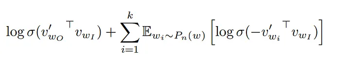
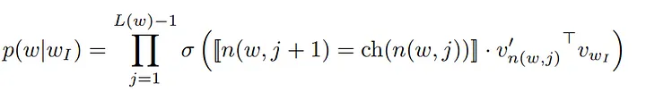
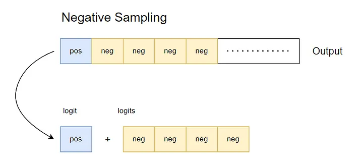
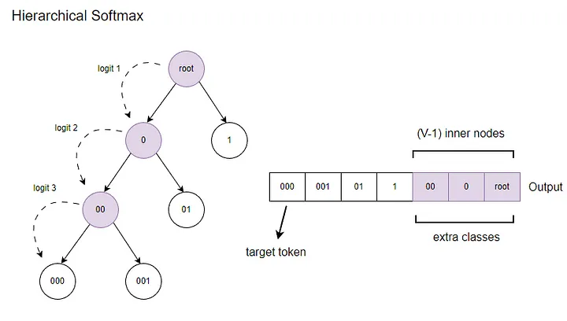
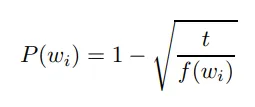
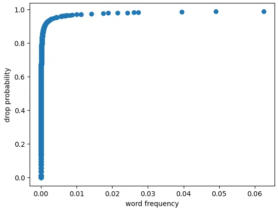
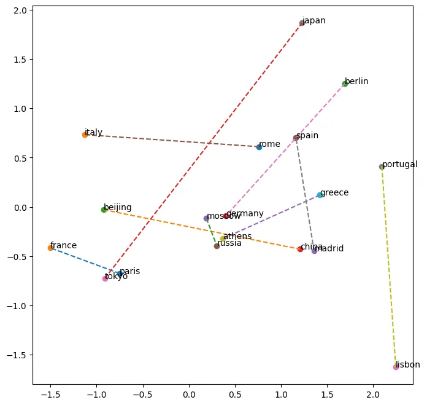

## Language model

While there may not be a vision model, we do have language and acoustic models. A language model is a probabilistic model that predicts the relationships between words. In a language model, a ‘word’ represents the smallest unit of meaning within a language. This unit can be a character, byte, or even a phrase.

Some of the earliest language models were built using Markov chains, which are probabilistic models used to estimate transitions between states. For example, a well-known Chinese word segmentation library ‘jieba’ is built upon its successor, the hidden Markov model.

You may have heard of cases where scholars questioned the authenticity of Shakespeare’s writings by examining writing style similarities. This examination involves various approaches, including historical, material, literary, linguistic, and statistical methods, to arrive at a conclusion. In these investigations, a robust language model plays a pivotal role, as it must grasp the intricacies of a language and serves as the cornerstone in modern natural language processing.

## Vector space and embedding layer

Words, or more precisely, tokens, are often encoded in a one-hot fashion (a statistical method known as categorical encoding). However, representing complex information in such a high-dimensional sparse space can be challenging. This sparsity is also observable in item recommendation systems and when dealing with high-cardinality categorical variables.

In these cases, the embedding layer functions as a projection matrix, transforming this sparse, orthogonal space into a more meaningful representation. In this representation space, each token can be represented by a vector of dimensions equal to the embedding size. By condensing thousands of dimensions into the embedding size, each dimension encapsulates profound interactions.

One of the most intriguing features demonstrated by Mikolov, the author of Word2Vec, is the linearity and additivity found within word vector space. For instance, “mother” and “father” are closer to each other than “mother” and “desk,” and “mother” + “day” results in a vector close to “father day.” This reveals that distances within the word vector space reflect similar relationships to the meanings in the language.

## Network design

Word2Vec has two types of network architectures, both of which aim to capture sentence structure and learn the relationships between words locally.

1. **Continuous bag-of-words(CBOW)**: given the context, predict the middle word.

2. **Skip-gram**: given the middle word, predict the context.

## Training

Due to the high cardinality of tokens, computation cost of Softmax will increase dramatically, therefore two loss functions to speed up the training of Word2vec are developed:

1. **Negative sampling**: computing the loss by using negative samples randomly drawn from a noise distribution. This technique focuses training on the sampled tokens. The noise distribution is based on the 3/4 power of the unigram distribution, the exponent is empirically chosen.

2. **Hierarchical Softmax**: computing the loss using a Huffman tree, which restricts the training to tokens along the path to the target token. The Huffman tree provides shorter paths for frequent tokens and longer paths for infrequent tokens, resulting in reduced search time during training.

Additionally, the author introduces a subsampling formula that filters words based on their frequency. The more frequent a word is, the higher the probability it will be discarded. We take this heuristic formula in a form of dropout, t is the threshold to determine if a word is frequent or not. Words with a frequency higher than t are more likely to be dropped, while those with a frequency lower than t are retained.

### Dataset

WikiText2, a language modeling dataset consists of a large collection of text derived from Wikipedia articles. For its size and diversity, it is commonly used in natural language processing (NLP) field.

Although it is commonly said so, I am still wondering why it is hard to read compared to Wikipedia.

## Evaluation

### Visualization

PCA and t-SNE are commonly used for visualizing word vectors, but creating a visually appealing parallel relationship like the ones in research papers can be challenging. Additionally, the size and quality of the data can significantly influence the vector representations.

While t-SNE is a common choice for visualizing word vectors in various applications, it’s worth mentioning that it can be computationally demanding.

### Analogical reasoning

I used the Berlin to Germany vector as the prototype to test the capital-to-country relationship, following the approach in the paper. However, I observed that other instances are not parallel to the prototype vector because the cosine similarity is highest for Berlin.

### Build phrase

In the second paper, a method for constructing phrases is proposed, which utilizes bigram count and unigram count to create a figure similar to lift in association rule mining. I’ve also come across a similar method in my colleague’s work for identifying new phrases. His approach incorporates log likelihood and can extend to longer n-grams. Therefore, if this method works for Chinese, it should work for English as well.

During the naive implementation, it can be challenging to determine an appropriate decision threshold for identifying meaningful words using this approach. However, I believe this challenge may be attributed to the nature of the corpus material. Nonetheless, we have successfully identified meaningful phrases such as ‘video game,’ ‘harry emerson’ and ‘join hands’.

If the reader is interested there are other mature phrase extraction methods to consider except this one, especially Chinese.

## Note

The model will be affected with the following factors:

1. The amount of parameters: embedding vector size, context size

   - A larger embedding vector size is advantageous for effectively distinguishing and separating words in visualization.

2. Preprocessing: subsampling, tokenization

   - The subsampling probability takes a different form in the author’s C implementation compared to what is described in the paper. In my own version, I’ve adapted it into a dropout-style approach, as an alternative approach to dropping vocabulary entirely at the outset.

   - Tokenization can affect the representation, and employing n-grams is a wise decision. If a finer-grained representation is desired, a larger dataset is preferred, although it comes with a substantial increase in computational burden.

3. Loss functions: NS vs HS vs NCE vs CE

   - Negative sampling (NS) requires a higher negative ratio to achieve convergence, and by its nature, sampling is a computation bottleneck compared to CE.

   - Hierarchical softmax (HS) is a sophisticated approach to implement and necessitates iterative search, which is time consuming.

   - Cross entropy (CE) is the simplest form, and its uniform nature ensures training for every character.
     
There was a time when numerous models were named after X2vec in various domains, such as item2vec, wav2vec, doc2vec, vid2vec, and more. Now, feature fusion techniques like these are commonly found across various models.

## Code

[My GitHub](https://github.com/gitE0Z9/pytorch-implemenations)

## Reference

[the first paper](https://arxiv.org/abs/1301.3781)

[the second paper](https://arxiv.org/abs/1310.4546)

[word frequency implementation](https://stackoverflow.com/questions/58772768/word2vec-subsampling-implementation)

[Author’s C implementation](https://github.com/dav/word2vec)