> Hope this article can help you avoid getting trapped by annoying and terrible bugs.

## Object detection

Why do we need object detection when we already have image classification? The reason is that in an image, there can be multiple objects of interest, and we want to determine both their classes and their locations simultaneously.

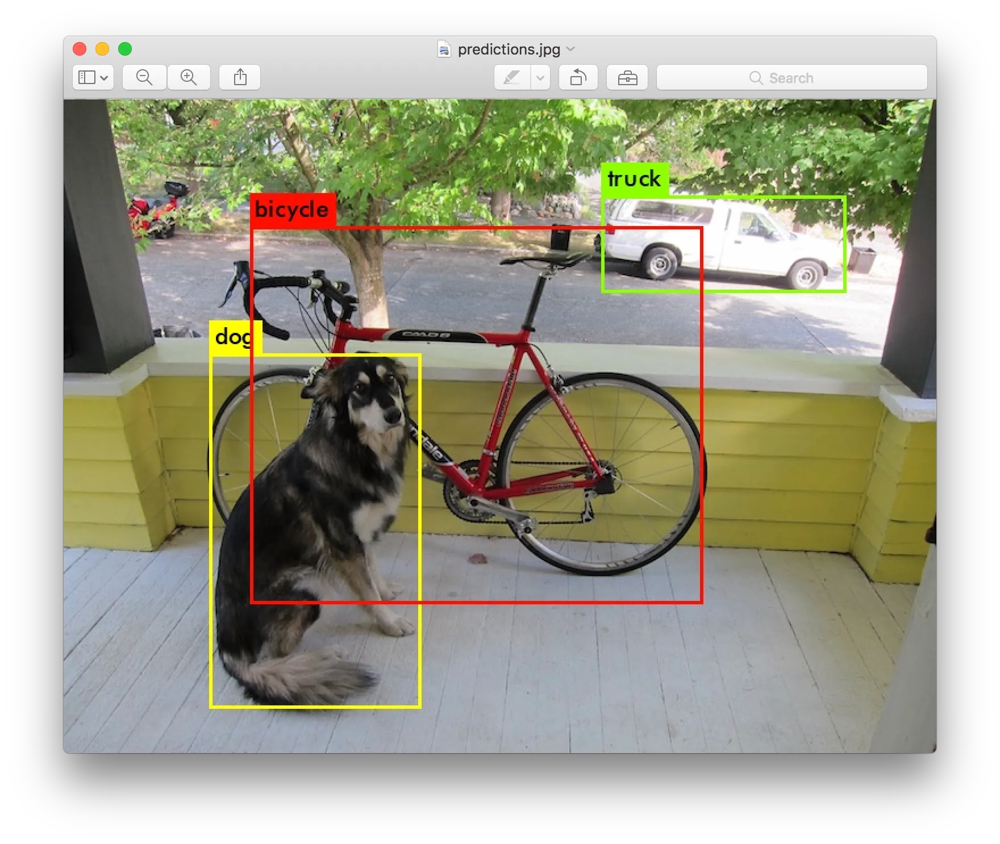

## The idea of YOLOv1

YOLOv1 is designed to do object detection by extracting features from images with convolution neural network only once, just its name implies. This distinction arises from the comparison between YOLO and other two-stage detectors, which require multiple feature extraction steps.

Take a look at the network architecture of YOLOv1. The first convolutional layer uses a 7x7 kernel and reduces the image size by half with a stride of 2, followed by four max-pooling layers and alternative 1x1 and 3x3 bottlenecks as the backbone.

The final four convolutional layers and two fully connected layers (dropout is used in the original implementation) make up the prediction head for the detection task.

For a pretrained YOLOv1 backbone, the prediction head can be replaced with a Global Average Pooling (GAP) layer followed by a fully connected (FC) layer.

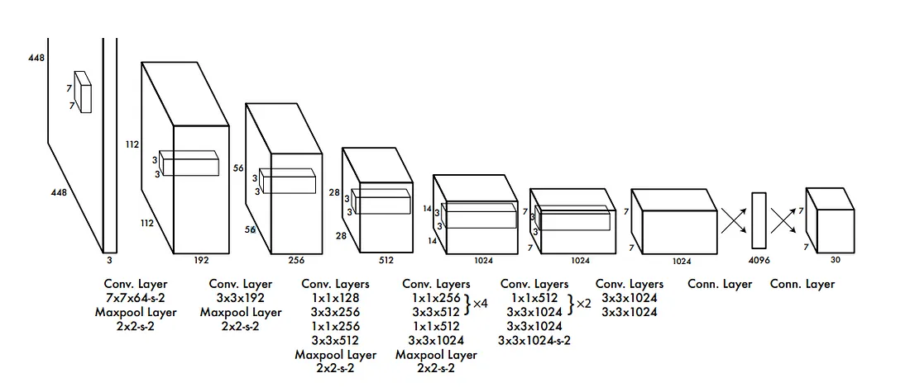

This model outputs a 7x7 grid feature map with 30 channels. These channels contain two sets of bounding box information (x, y, w, h, c) and probabilities for 20 VOC classes, resulting in a total of 7x7x2=98 candidate bounding boxes. Each grid cell is responsible for predicting two candidates associated with objects in the corresponding cell.

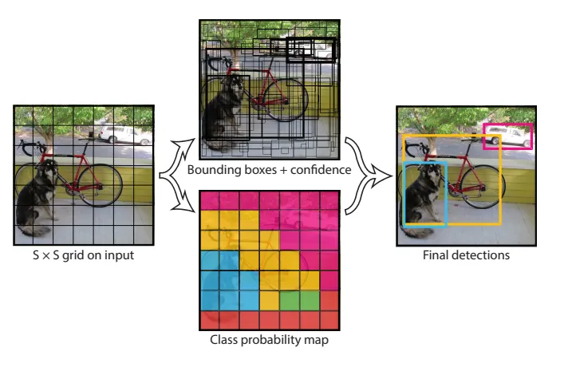

### Localization

The localization can be approached from the loss function and the label creation.

The localization loss consists of the mean square error of

> 1. x and y offsets
> 2. width and height
> 3. the confidence of the object and the non object.

These position figures are relative to the input image size and bounded in [0,1].

The label includes the x and y offsets relative to the top left corner of a grid cell. This approach is used to ensure that optimization is not significantly affected by scale variations and focuses on the individual grid cell.

Consider if we were to directly use the x and y center coordinates of a bounding box. In such a case, there might not be enough information within a single cell to determine how far the object is from the border of the image.

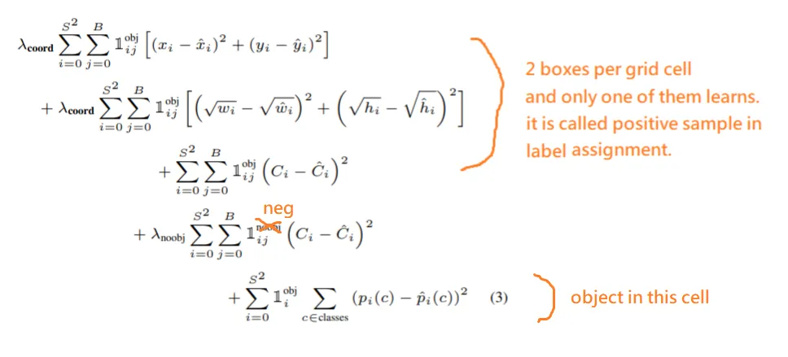

### Objectness

The introduction of indicator functions is crucial, and there are three types of them:

1. Object indicator : This guides the model to learn information about objects, especially in cases where there are many absent grids in an image that provide no information about objects.

2. Non-object indicator : It helps prevent the remaining bounding box predictors from being overly confident about their cells. This is essential to avoid the model generating numerous bounding boxes with high confidences.

3. Responsible bounding box indicator : This indicator assists predictors of a grid cell in learning different shapes.

Using Intersection over Union (IOU) as the objectness measure can result in a 10% mean Average Precision (mAP) increase compared to simply determining whether an object is present in a cell or not. Therefore, it can be argued that the probability of an object’s presence isn’t actually estimated but is more of a formula artifact.

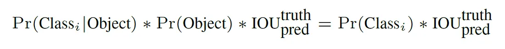

### Classification

Either use softmax for multiclass prediction (where classes are mutually exclusive) or Bernoulli log likelihood (where each class is independent, and each class has its own probability).

## Implementation

### Compared to the original implementation

Didn’t implement

1. ImageNet pretrained weight for yolov1 backbone
2. Learning rate scheduler

What change

1. Replace fully connected classifier with convolution layers, or huge memory will be required.
2. Substitute the backbone with torchvision’s Resnet.

---

### Training Dataset

VOC 2012 trainval.

### Build the model

I adhered to the network design described in the paper, with the only difference being the replacement of the final fully connected layer with a 1x1 convolutional layer.

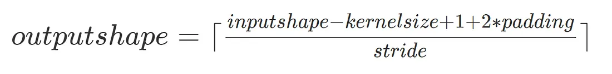

#Edit: The backbone is also replaced with torchvision’s pretrained Resnet. Training a YOLOv1 classifier on ImageNet would take approximately a month QQ.

### Loss function

Performing a square root operation on the height and width can introduce the risk of a numerical instability issue. To mitigate this, it's necessary to add an epsilon (a tiny number) before taking the square root. I used the trick of squaring and then adding epsilon before taking the square root.

I also attempted Darknet's approach to address this issue. They directly predict the square root of the width and height of bounding boxes, and then square these predictions during IOU computation. However, I encountered difficulties in training convergence, even when incorporating their best Root Mean Square Error (RMSE) selection technique.

### Data Augmentation

I applied [Albumentation’s](https://github.com/albumentations-team/albumentations) color jitter, horizontal flip, and shift-scale-rotate transformations, each with a probability of 0.5 and default scaling. These transformations resulted in a 10% increase in mean Average Precision (mAP) compared to not using them, and they also improved the quality of the bounding boxes.

### Training

After setting up the dataset, network, and loss function, the training process begins — a seemingly endless cycle of experiments and debugging.

The final model size is as following:

YOLOv1 backbone is about 229MB.

Resnet18 model is about 165MB.

Resnet34 model is about 209MB.

------

### Decode output

YOLOv1 outputs a 7x7x30 feature map, which is then reshaped to 98x25 for easier post-processing. While YOLOv1 provides two bounding boxes for position information, it shares class information. Sharing class information is not seen in later version of YOLO.

### Postprocessing

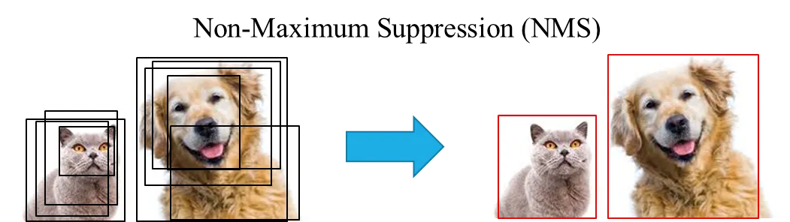

Greedy Non-Maximum Suppression (NMS) is employed to clean up overlapping bounding boxes. The concept behind NMS is straightforward: when predictions overlap significantly, retain the one with the highest confidence score.

One important lesson to remember is that this operation should be performed separately for predictions of the same class.

### Probability

Multiply conditional class probability with object confidence to get marginal class probability.

### Validation Dataset

VOC 2007 test.

### Evaluation metric

Mean average precision is a metric to measure how well an object detector performs. We split this term into three words to explain.

‘Mean’: It involves taking the average of the Average Precisions (APs) for different classes.

‘Average’: This part involves calculating the area under the Precision-Recall curve and averaging the precisions over recalls.

‘Precision’: Refers to the percentage of predictions that have passed the IOU (Intersection over Union) threshold at a given point in the recall.

This metric originates from information retrieval and is relevant to the following questions:

> If I am interested in how many cats in this image dataset, how could I evaludate it?

1. The object detector scans the dataset for objects that could be cats and retrieves bounding boxes for them.

2. These bounding boxes are then sorted by their probability of being related to cats, similar to a search engine ranking results.

3. You manually review these query results to determine if they are what you’re looking for.

4. When you encounter bounding boxes that overlap sufficiently with ground truths (actual cats) in the dataset, you calculate precision as the number of correct detections divided by the total number of detections up to that point. Recall is calculated as the number of correct detections divided by the total number of cats in the dataset.

> Why don’t we use accuracy ? Isn’t there a metric that’s easier to understand and compute?

It’s a valid question, and the reason is somewhat similar to why we use ROC curves. Although positive and negative are defined differently in these two types of curves, they share many similarities. The Precision-Recall (PR) curve takes into account ranking and treats predictions as if they are not equally important compared to standard classification. It also uses recall as a threshold rather than predicted probability as a threshold.

If you were to try accuracy(cat) = #detections over IOU / #cats, you’d encounter issues with different denominators across different classes, making them not directly comparable. Additionally, the number of predicted bounding boxes might differ from the number of ground truths, further complicating the accuracy calculation.

## Evaluation

mAP is calculated across the dataset in a manner similar to how we calculate accuracy, but it’s done separately for each class. The list below represents the Area Under the Curve (AUC) of the interpolated Precision-Recall curve for each class.

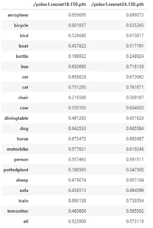

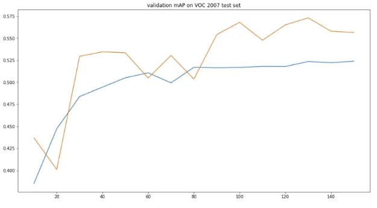

Compared to the original mAP in the paper, which was 63.4, I achieved 52.4 mAP for ResNet18 and 57.3 mAP for ResNet34 by implementing the following tricks:

> 1. Lowering the learning rate.
> 2. Using IOU as the objectness measure.
> 3. Utilizing a larger backbone (note that YOLO’s backbone is more efficient with fewer layers).
> 4. Applying the non-object loss to all negative boxes.
> 5. Implementing data augmentation, especially those related to object position like flipping and affine transformations. However, color-related augmentations did not yield significant improvements, suggesting potential for further enhancements in this aspect.
> 6. Removing difficult objects from both the training and test datasets.

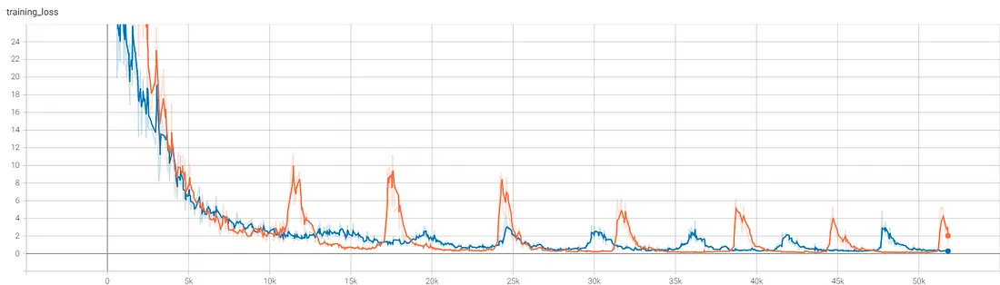

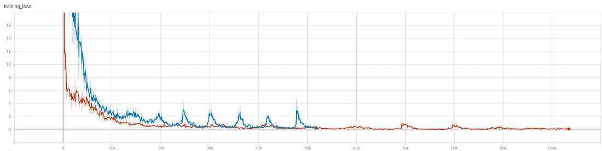

### Demo

Detections from 0 to 100 epochs on trainset.

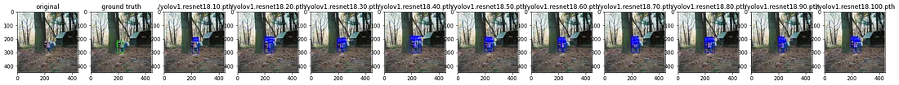

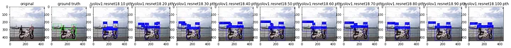

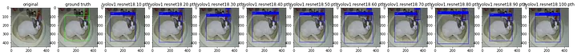

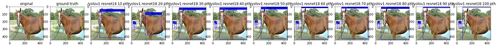

## Note

1. It looks like the model can identify more objects than provided labels, , and it’s constrained by the available labels.

2. The metric mAP does not penalize low-confidence boxes.

3. It raises the question of why the model cannot inherently learn invariant representations and instead relies on external stimuli like data augmentation.

4. Given that the network’s output is not bounded in the [0, 1] range, numerous numerical issues in the loss function need to be addressed.

5. Enhancing object confidence is the core objective of this task: determining where objects are located.

6. The default alpha value for the leaky ReLU in PyTorch is 0.01. I set it to 0.1, as otherwise, the network may output the same tensor every time, leading to degeneration.

## Code

[My GitHub](https://github.com/gitE0Z9/pytorch-implemenations/tree/main/object/detection/library)
## Reference

[aladdin's github repo](https://github.com/aladdinpersson/Machine-Learning-Collection/tree/master/ML/Pytorch/object_detection/YOLO)

[paper](https://arxiv.org/abs/1506.02640)