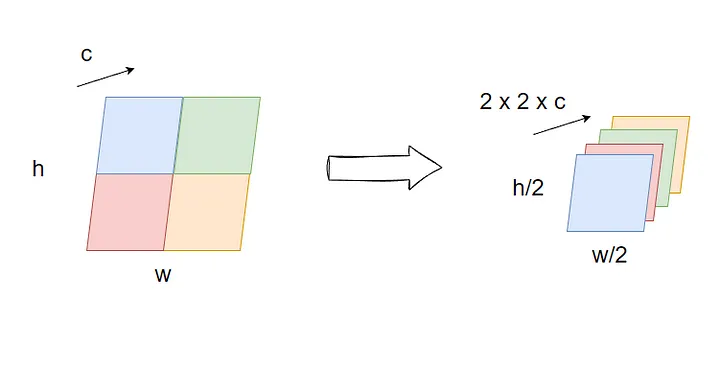
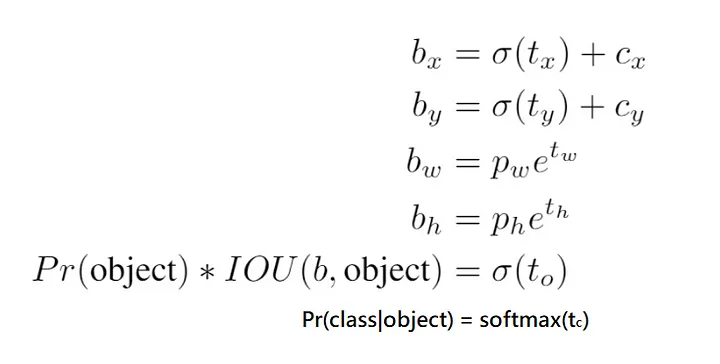
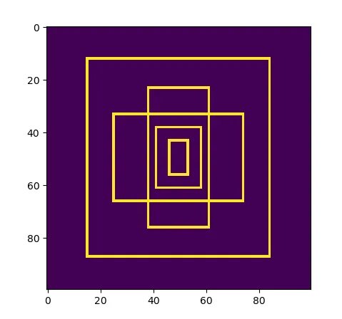
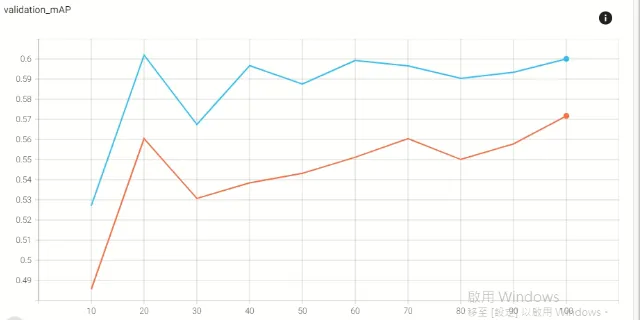

## Improvements over YOLOv1

### Backbone

Darknet19 is the successor to YOLOv1 backbone(Extraction). There are four differences from the latter

1. *batch normalization*

2. *convolution prediction head* instead of fully connected layer

3. *passthrough to combine features of different layers*, the feature would be compressed to one eighth of channels and folded to one fourth of size.

4. *remove one pooling layer* results in more output boxes since downsampling scale is 32 which is twice than before.

### Prediction output

Compared to YOLOv1, YOLOv2 has its outputs transformed to reasonable range, they are finally all nonnegative!

The most worthy to mention is the width and height, the square root is removed and changed to log difference between truths and anchors just like SSD does.

### Dimension prior

YOLOv2 uses a different strategy to calculate the shape of anchors by K-means rather than hand-crafted. I got group-averaged IOU between 0.61~0.64.

### Loss function

The formula itself doesn’t change much but the matching strategy does. This time the assumption that only one object in a cell is relaxed, every box will match with more than one ground truth and thus a cell will get more than one prediction.

1. **Non object loss**: those boxes don’t match a single ground truth with IOU higher than the threshold.

2. **Object loss**: for positive anchors, each corresponding box predicts their own best matched ground truths.

3. **Prior loss**: when training on the first 12800 seen pictures, we will calculate gradients for prior loss of negative anchors. Quite heuristic, not seen in later version of YOLO series.

4. **Coefficients of loss components**: the coefficient of the object loss is 5, the others are 1.(In YOLOv1, the coef. of location loss is 5 and that of no object loss is 0.5).

Since there are so many anchors in a cell and the probability map coupled with anchors instead of cells now, we won’t see the classic ‘class probability map’ afterwards.

### Training strategy

1. *high-resolution finetuned classifier*

Gave up training on my own since it is impossible to train a modern classifier on ImageNet in a day with a single common GPU(even 1 epoch for ResNet18 takes 14hrs). Instead I converted weights from Darknet to PyTorch to test this strategy.

2. *multiscale training for detector*

I randomly picked resolution every one epoch, however the model performed even worse.

3. *part supervision*

According to the paper, there are two stages to train YOLO9000, “train the classifier” then “jointly train classifier and detection”. The matching strategy and the loss function is adjusted here.

**Hierarchical softmax tree**

This method can extend detection labels with classification alone.

Under construction…

## Implementation differences

1. Multiscale per epoch not per 10 batch. (Not used)

2. No learning rate schedule.

3. Data augmentation might be different.

4. Resnet18 isn’t high resolution finetuned, but the detector with this backbone can still performs equally well as Darknet-19 finetuned one.
Code

## Results

### Evaluation

> *classifier*

Darknet-19 : 69.2% vs 72.9%

Darknet-19(448) : 75.9% vs 76.2%

weights are converted from https://pjreddie.com/darknet/imagenet/

> detector

all trained 100 epochs

In paper, Darknet-19(448): 76.8 mAP

ResNet-18 (no high-res finetune or multiscale): 57.1 mAP

ResNet-34 (no high-res finetune or multiscale): 60.2 mAP

=> not much improved from the last version.

### Demo

## Code

[My GitHub](https://github.com/gitE0Z9/pytorch-implemenations/tree/main/object/detection/library)

## Reference

[paper](https://arxiv.org/abs/1612.08242)

[darknet](https://github.com/AlexeyAB/darknet)
